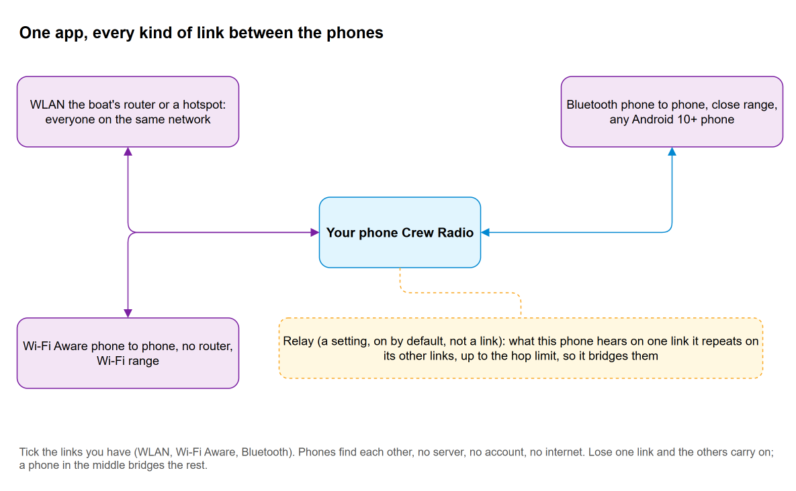
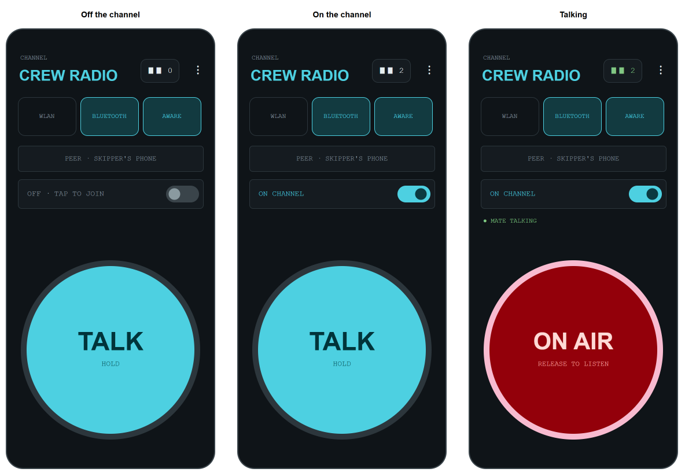
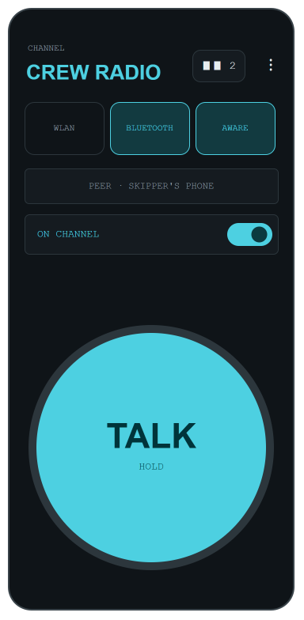
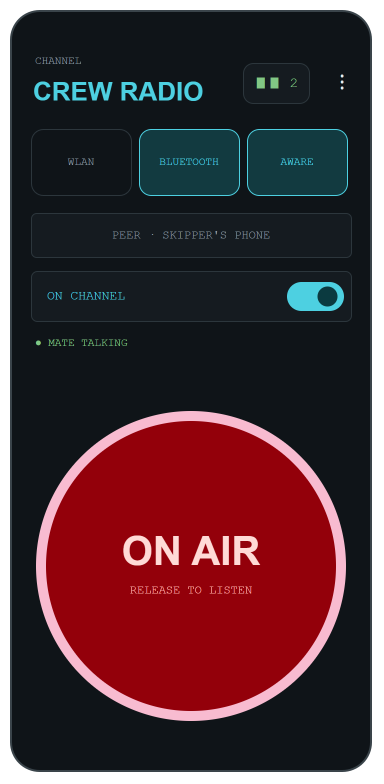
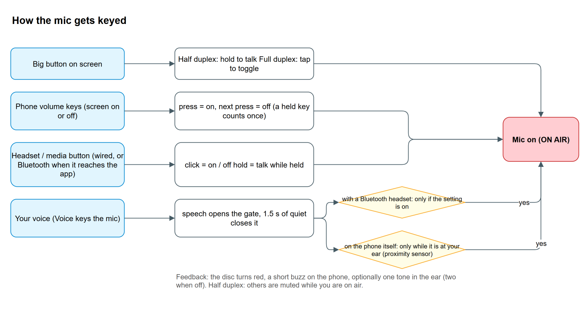
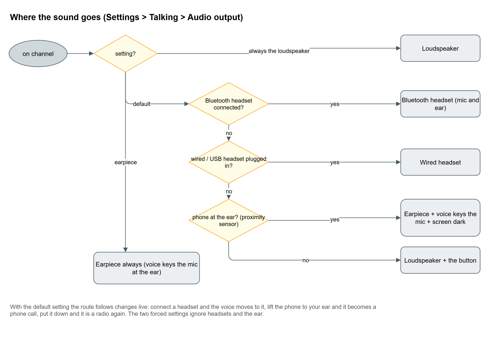
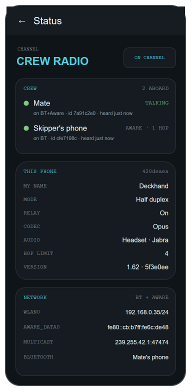
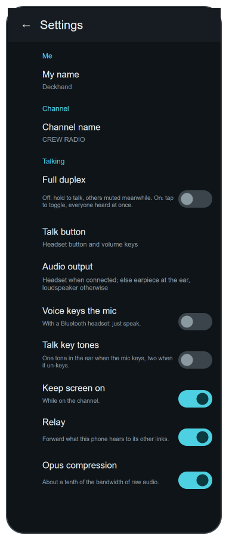
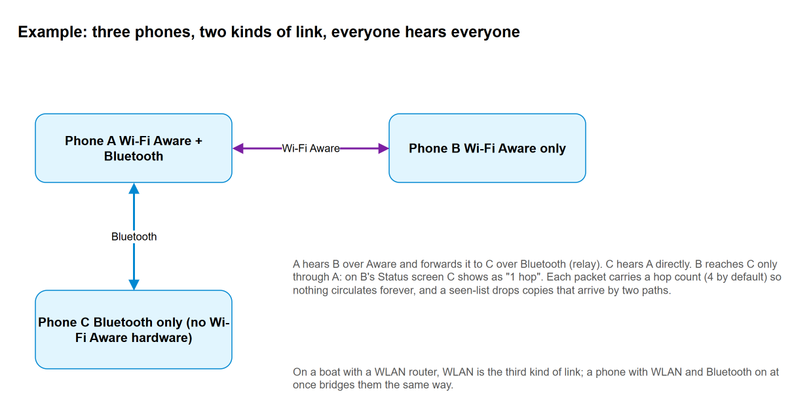

# Crew Radio

**A walkie-talkie for a crew, made of the phones they already carry.**

Crew Radio turns a handful of Android phones into an intercom that works where there is no
network at all: on a boat, on a hike, at a work site, in a building with dead spots. It uses
every kind of link the phones have — the boat's WLAN, Wi‑Fi Aware (phone to phone, no router),
Bluetooth — all at the same time, and every phone repeats what it hears to the phones it can
reach, so the crew stays connected as long as there is *some* path between them. No server,
no account, no internet, no subscription. Connecting people, with what is in their pockets.

## What it does

- **Press to talk**, radio style: hold the big button and the whole crew hears you. Or switch to
  full duplex and talk over each other like a phone conference.
- **Any link, all at once.** Tick WLAN, Bluetooth, Wi‑Fi Aware — whatever the phones have. A
  phone with two kinds of link bridges them.
- **Mesh and relay.** What one phone hears on one link it repeats on its others, up to four hops.
  Two phones that cannot reach each other still talk through a third.
- **Works with the screen off**, in a pocket, with a headset on, or with the phone at your ear
  like a call.
- **Shows the crew.** Who is on the channel, who is talking, how each one is reached.
- **Nothing to set up.** Install the same app on each phone, join the channel, talk.

## Install

1. On each phone open the [Releases](../../releases) page, download the newest
   `CrewRadio-<version>.apk` and allow the install (Android asks once to allow installs from
   the browser).
2. Give the app the permissions it asks for: microphone, and nearby devices / Bluetooth for the
   links you plan to use.
3. Every phone on the crew must run the **same version**. The Status screen (menu ⋮ › Status)
   shows the version at the bottom of *This phone*.

## Quick start

1. **Pick your links.** Tap the tiles at the top: **WLAN** if all phones share a network (the
   boat's router, or one phone's hotspot); **AWARE** for phone-to-phone over Wi‑Fi with no
   router (most recent Samsung and Pixel phones have it; the tile is greyed out on phones that
   don't); **BLUETOOTH** for any two phones that are paired in the phone's Bluetooth settings.
   Tick more than one if you have them.
2. **Bluetooth only:** on one phone choose *Listen only* in the peer row, on the other pick that
   phone from the list. Bluetooth links pairs of phones; a phone can be the listening end for
   several others.
3. **Join the channel.** Tap the switch row. It reads *ON CHANNEL*, the head count at the top
   shows who else is there, and the notification says what the links are doing.
4. **Talk.** Hold the big disc. It turns red, *ON AIR*, and everyone hears you. Let go to
   listen. While someone else talks, their name appears in green above the disc.
5. **Leave.** Tap the switch row again, or *Disconnect* in the notification. Closing the app's
   window does not leave the channel; that is on purpose, so it survives in a pocket.

 

## Talking without touching the screen

The disc is the simplest way, but on deck your hands are busy. Every one of these keys the mic
while you are on the channel; pick them under **Settings › Talking**.

| Way | What to do | Notes |
| --- | --- | --- |
| **Phone volume keys** | Press once: mic on. Press again: mic off. | Works with the screen off. A held key counts as one press. Volume keys do nothing else while on the channel. |
| **Headset button** | Click: mic on/off. Hold: talk while held. | Wired headsets always. Many Bluetooth hands-free headsets do *not* pass their button to apps while their microphone link is up (that is how the headset works, not the app); use your voice with those. |
| **Your voice** | Just speak. | *Voice keys the mic* (Settings › Talking). With a Bluetooth headset: on air within 40 ms of speaking, off 1.5 s after you stop, silent while the headset is muted. On the phone itself it is always on while the phone is at your ear (see below). |
| **Phone at your ear** | Lift the phone to your ear like a call and speak. | The sound moves to the earpiece, the screen goes dark so your cheek cannot press anything, and your voice keys the mic. Put it down and it is a loudspeaker with a button again. |

Feedback either way: the disc turns red, the phone gives a short buzz when the mic keys and a
double buzz when it un-keys, and *Talk key tones* (off by default) adds one tone in the ear on,
two off.

## Headsets and where the sound goes

Connect a Bluetooth headset and the voice moves to it, both ways, the moment it connects; a
wired or USB headset when plugged in. Otherwise the loudspeaker, or the earpiece while the
phone is at your ear. **Settings › Talking › Audio output** can pin it to the loudspeaker
(headsets and the ear ignored) or to the earpiece.

Half duplex on a loudspeaker works well; **full duplex** (everyone heard at once) is far better
with a headset, because a loudspeaker feeds back into the microphone.

## The Status screen

Menu ⋮ › **Status** is the place to look when something seems off. It shows every crew member
with the link they arrive on, how many hops away they are, what they are connected to and when
they were last heard; this phone's name, mode, codec, where the audio goes and the app version;
the phone's addresses; packet counters (received, sent, relayed, duplicates dropped, concealed,
hellos); and the last forty status lines with time stamps.

 

## Settings

| Setting | Meaning |
| --- | --- |
| **My name** | What the others see in their crew list. Empty: the phone's own name. |
| **Channel name** | The big word at the top: the boat, the crew, the site. |
| **Full duplex** | Off (default): hold to talk, others muted while you hold. On: the disc toggles the mic and everyone is heard at once. |
| **Talk button** | Which hardware keys key the mic: headset button, volume keys, both, or off. |
| **Audio output** | Headset when connected, else earpiece at the ear and loudspeaker otherwise (default); always the loudspeaker; or the earpiece. |
| **Voice keys the mic** | With a Bluetooth headset, speech keys the mic (see above). |
| **Talk key tones** | A tone in the ear when a talk key keys or un-keys the mic. |
| **Headset button hangs up** | Only for a Bluetooth headset whose button sends a hang-up: registers the channel with the phone as a call while it is in use, so the hang-up becomes the talk key. Shows on car kits as a call; a phone call puts the channel on hold. |
| **Keep screen on** | While on the channel. Turn off when a headset or the volume keys do the talking. |
| **Relay** | Forward what this phone hears to its other links. Leave on. |
| **Opus compression** | On (default): about a tenth of the bandwidth of raw audio. |
| **WLAN group and port** | The multicast group every phone listens to. Change only if it clashes with something on your network, and change it on every phone. |
| **Wi‑Fi Aware passphrase** | Phones must share it to link. Change it to keep another crew out. |
| **Hop limit** | How many phones a packet may be relayed through (4). |

## How it works, briefly

Every phone is the same: there is no master. Your voice is captured in 20 ms slices, compressed
with the Opus codec built into Android, and sent as small packets on every link you have on.
Each packet carries who sent it, a running number and a hop count. A phone that receives a
packet plays it, and — if relay is on and hops remain — repeats it on its *other* links, so a
crew becomes a mesh. A list of recently seen packets stops copies that arrive by two paths, and
the hop count stops anything circulating forever. Once a second every phone sends a tiny hello,
which is how the crew list knows who is there and how they are reached; four missed hellos and a
phone drops off the list.

Links look after themselves: a Bluetooth peer that walks out of range is redialled with a
growing delay, a Wi‑Fi Aware peer is picked up again as soon as it reappears, and when Wi‑Fi
itself drops the WLAN link rejoins when it is back. A lost packet is papered over with a fading
repeat of the previous one rather than a click. The developer notes in
[docs/ARCHITECTURE.md](docs/ARCHITECTURE.md) go into the detail, with flowcharts.

## Good to know

- **Range.** Bluetooth: a few metres to a few tens of metres, line of sight helps. Wi‑Fi Aware:
  Wi‑Fi class, tens of metres. WLAN: wherever the router reaches. Chain phones to go further.
- **Guest or public Wi‑Fi** often isolates clients from each other, which blocks WLAN links.
  Use Bluetooth or Wi‑Fi Aware there, or one phone's hotspot.
- **Battery.** On the channel the app keeps the radio links and, with voice keying, the
  microphone open. Expect it to use noticeably more than an idle phone.
- **Notifications.** On Android 13 and newer allow notifications, or the channel runs without a
  visible notification (it still runs).
- **Privacy.** Nothing leaves the phones. There is no server; on WLAN anyone on the same network
  with the app and the same group could listen, and Wi‑Fi Aware links need the shared passphrase.

## Build it yourself

Open the folder in Android Studio (Koala or newer) and build, or run `./gradlew assembleDebug`
with an Android SDK (platform 34). Pure-Kotlin unit tests: `./gradlew testDebugUnitTest`.
Real testing needs two or more phones; the emulator has neither Bluetooth nor Wi‑Fi Aware.

The version is `1.<number of commits on main>`, set by the build from git; every merge to `main`
builds a signed APK and publishes it on the Releases page. Pull requests get the same APK as a
workflow artifact, signed with the debug key (the release key is only used on `main`).
`assembleRelease` signs with the crew's release key when the `CREWRADIO_KEYSTORE`,
`CREWRADIO_KEYSTORE_PASSWORD`, `CREWRADIO_KEY_ALIAS` and `CREWRADIO_KEY_PASSWORD` variables are
set and with the debug key otherwise. Android will not upgrade a debug-signed install with a
release-signed one in place, or the reverse: uninstall first when switching (the app keeps no
data worth losing).

## Licence and credits

Kotlin, Android 10 and newer, no third-party libraries. Written for a sailing crew and shared so
that any crew can use it. The developer notes are in [docs/ARCHITECTURE.md](docs/ARCHITECTURE.md);
the diagrams are draw.io files under [docs/diagrams](docs/diagrams), generated by
`make_diagrams.py` there.
