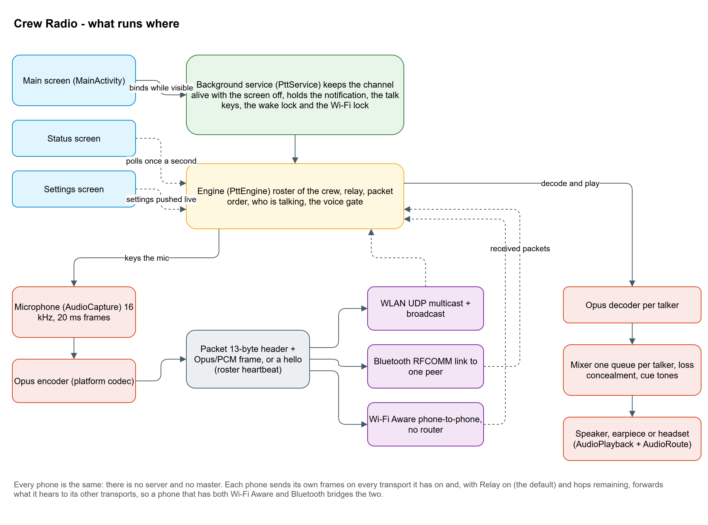
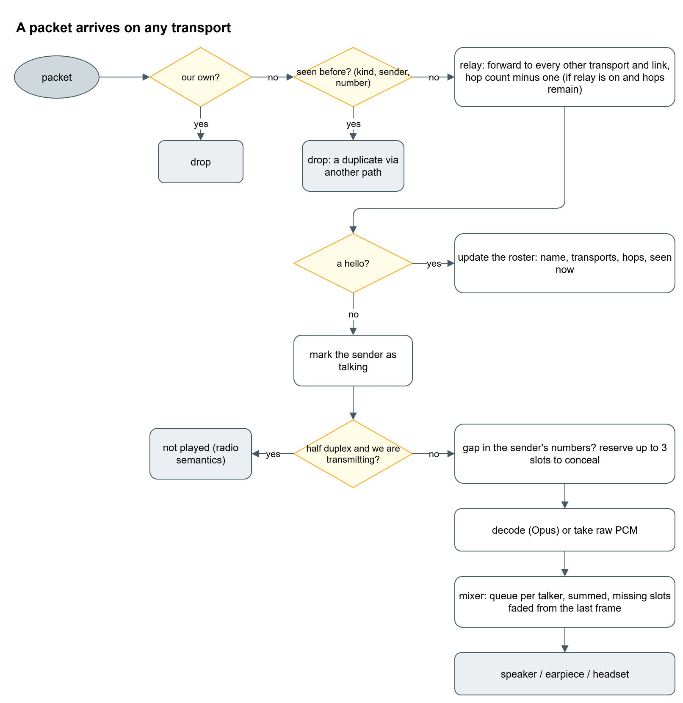

# Crew Radio — how the code works

Developer notes. The [README](../README.md) is for the people who use the app; this is for
the people who change it. Everything here is about the `app` module, package `fi.crewradio`.

## In one picture



- **`MainActivity`** is the one screen that matters while talking: channel name, head count,
  transport tiles, the peer row (Bluetooth only), the channel switch and the talk disc. It binds
  to the service while visible and never leaves the channel on its own lifecycle.
- **`PttService`** is a foreground service (types microphone | connected device). It owns the
  engine, the partial wake lock and the low-latency Wi‑Fi lock, the notification that mirrors
  the status line, the `MediaSession` that turns hardware keys into talk keys, and the
  proximity screen-off lock while the phone is used at the ear.
- **`PttEngine`** is the heart: transports, the crew roster, relay, packet ordering, loss
  concealment, the talk state, the voice gate. It knows nothing about screens.
- **Transports** (`transport/`) carry packets: `LanTransport` (UDP multicast plus subnet
  broadcast), `BluetoothTransport` (RFCOMM, one link per pair), `WifiAwareTransport` (NAN
  discovery plus TCP data paths). All of them are symmetrical: every phone is server and client.
- **Audio** (`audio/`) is the capture → Opus → packet path on the way out and the decoder →
  mixer → playback path on the way in, with `AudioRoute` deciding where the sound goes.

## The audio path

16 kHz mono, 20 ms frames (640 bytes of PCM16), see `audio/AudioConfig`. Nothing outside the
platform is used: `AudioRecord` with the voice-communication source (which enables the phone's
echo cancellation and noise suppression), the AOSP Opus codec through `MediaCodec`
(`audio/opus`, available since API 29), `AudioTrack` for playback.

- `AudioCapture` pulls frames from the mic on its own thread and hands them to the engine.
- `OpusEncoder` / `OpusDecoder` wrap `MediaCodec`. The AOSP decoder always outputs 48 kHz, hence
  `Decimator` back to 16 kHz. One decoder per talker, created on demand, at most eight (the
  quietest is evicted), released after 30 s of silence. If the encoder fails the engine falls
  back to raw PCM and says so.
- `Mixer` keeps a small jitter queue per talker (two frames of pre-fill, ten at most), sums the
  queues into one stream on its own thread, and paces itself on the blocking `AudioTrack`
  write. It also plays cue tones (`Tones`) on top of whatever is sounding.
- Loss concealment lives in the mixer, not the codec, because `MediaCodec` cannot ask the AOSP
  Opus decoder for it (an empty input buffer yields empty output). `Conceal` repeats the last
  frame with decaying gain (0.6ⁿ) for at most three missing slots, then silence. The engine
  detects gaps from each sender's sequence and reserves slots ahead; the mixer also conceals a
  queue that runs dry while its sender is still talking.
- `AudioRoute` owns `AudioManager.mode` for the session and picks the communication device:
  Bluetooth SCO headset, else wired/USB headset, else the earpiece while the phone is at the
  ear (default policy) or the loudspeaker. It follows headsets as they come and go, re-opens
  the SCO link if the headset drops it, and reports every change on the status line.

## Packets and the mesh

```
'P' 'T' | version = 2 | codec | ttl | senderId int32 | seq int32 | payload
```

Codec 0 is a PCM16 frame, 1 an Opus packet, 2 a `Hello` (roster heartbeat: name, transport
flags, hop budget). Audio frames and hellos number themselves independently per sender.



Relay is application-level flooding with two brakes: a seen-cache keyed by (sender, number),
one cache per packet kind because audio and hellos number themselves independently, drops
copies that arrive by two paths, and the ttl (clamped to this phone's own hop limit,
then decremented in place) stops circulation. A packet is forwarded to every *other*
transport, and, on transports with several links (Bluetooth, Aware), to the other links of the
same transport. `LanTransport` sends every frame twice, to the multicast group and to the
interface's broadcast address, because plenty of access points filter multicast; the
seen-cache drops the duplicate on the receiving side.


The roster: a heartbeat thread sends a hello every second; every hello or audio packet refreshes
the sender's entry (name, transports, via which transport, hops, talking). Silent for four
seconds means gone. The main screen shows only the head count and who is talking; the Status
screen polls the full list once a second.

Reconnect lives inside each transport, never in the engine: Bluetooth re-dials its chosen peer
from the reader's `finally`; Aware wraps each peer link in a `Dial` that schedules its
successor while discovery still sees the peer, and re-attaches the whole session when Aware goes
away; LAN's receive thread owns the socket and re-opens it when it breaks or Wi‑Fi changes.
All of them wait with `transport/Backoff` (1 s doubling to 15 s). Every transport thread runs
through `transport/transportThread`, which catches everything (the Bluetooth and Aware stacks
throw `SecurityException` for a missing runtime permission) and reports instead of killing the
app.

## Keying the mic


- The on-screen disc: hold in half duplex, tap to toggle in full duplex.
- `PttService` holds a `MediaSession` while on channel. Headset and media buttons arrive as
  media-button events with press and release, so a click toggles and a hold of at least
  400 ms is push-to-talk. The phone's volume keys arrive through a remote `VolumeProvider`,
  the only way an app gets them with the screen off; that reports adjustments only and
  autorepeats, so a quiet gap of the platform key-repeat timeout makes a hold count once.
- `MicGate` is voice-operated keying: two frames above the open threshold key the mic (a
  100 ms pre-roll is sent first so the first syllable survives), 75 frames below the close
  threshold un-key it. Thresholds are 80/40 RMS for a noise-suppressed headset boom and
  300/120 for the phone's own mic (`MicGate.tune`). On the phone the gate is armed only while
  the proximity sensor reads near: through the voice-call path close talk and a talker a
  metre away land in the same level range, so the ear is the discriminator, as in a phone call.
- Why not the Bluetooth headset's own button? Measured on a Jabra Evolve2 65 with a Galaxy
  S25: while its SCO link is up the headset transmits nothing for its button (no AVRCP, no
  HFP command) on tap, double-tap or hold; with a Telecom call it sends an AVRCP Play, which
  Android refuses to deliver to any app while a call exists. Its mute arrives only as an HFP
  microphone-gain value the phone stores and no app can read. Hence the voice gate. For
  headsets that do send a hang-up there is the opt-in `headset_call` mode: `CallService` places
  a self-managed Telecom call while a Bluetooth headset is the route, so the hang-up lands in
  `ChannelConnection.onDisconnect` as a talk toggle.


## Settings

`SettingsActivity` is a stock `PreferenceFragmentCompat` over the default shared preferences;
`Prefs` reads them with validated fallbacks and `SettingsRules` holds the pure, unit-tested
validation. Mode, relay, codec, name, hop limit, audio route and the talk-key settings are pushed
into the engine on every bind and resume (the settings, not the engine, are the source of
truth); group, port and passphrase are constructor arguments of the transports, so they need
a rejoin.

## Layout

| File | What it is |
| --- | --- |
| `MainActivity` | The screen, permissions derived from the enabled tiles, binds to the service |
| `StatusActivity` | Crew detail, addresses, counters, the status log; polls once a second |
| `SettingsActivity`, `Prefs`, `SettingsRules` | Settings screen, validated reads, pure validation rules |
| `PttService` | Foreground service: engine owner, locks, notification, `MediaSession`, ear screen-off lock |
| `PttEngine` | Transports, roster, relay, sequence tracking, concealment, talk state, voice gate |
| `CallService`, `CallBridge` | Opt-in self-managed Telecom call for hang-up-style headset buttons |
| `Packet`, `Hello`, `SeqTracker` | Wire header, roster heartbeat payload, per-sender sequence admission |
| `audio/AudioConfig` | 16 kHz, 20 ms, frame sizes |
| `audio/AudioCapture`, `audio/AudioPlayback` | Mic in, speaker out, each on its own thread |
| `audio/OpusEncoder`, `audio/OpusDecoder`, `audio/Decimator` | Platform Opus and the 48 → 16 kHz step |
| `audio/Mixer`, `audio/Conceal`, `audio/Tones` | Per-talker queues, loss concealment, cue tones |
| `audio/MicGate` | Voice-operated keying |
| `audio/AudioRoute` | Headset, earpiece or loudspeaker, following the hardware and the ear |
| `transport/Transport` | The interface: `start`, `send` (returns whether anything went out), `stop`, `relayWithin` |
| `transport/LanTransport`, `BluetoothTransport`, `WifiAwareTransport` | The three carriers |
| `transport/StreamLink`, `Backoff`, `Threads` | Length-prefixed framing, retry schedule, guarded threads |

## Building and releasing

`./gradlew assembleDebug testDebugUnitTest` with an Android SDK (platform 34). Unit tests are
pure Kotlin (JUnit 4) and cover the packet format, hello payload, settings rules, backoff,
decimator, concealment, tones, the sequence tracker and the voice gate. Anything with a
transport or a codec needs real phones.

Versions come from git in `app/build.gradle.kts`: `versionCode` is the commit count,
`versionName` is `1.<count>`, and the short commit hash is shown on the Status screen.
`.github/workflows/build.yml` runs the tests and a debug-signed release build on every push and
pull request (read-only token, no secrets) and, on a push to `main`, a second job signs with the
crew's key from the repository secrets and publishes a GitHub Release with the APK.

## Conventions

- Keep transports symmetrical: no designated master, the crew must survive any phone dropping.
- Anything blocking (sockets, `AudioTrack.write`) lives on its own named thread (`ptt-*`).
- Status strings are shown verbatim on the status line and in the notification: keep them short,
  and report rather than swallow, except transient send failures.
- Every phone must run the same build; the wire format has no compatibility mode.
- The diagrams on this page are generated: edit `docs/diagrams/make_diagrams.py`, run it, and
  export with draw.io desktop (the command is at the top of the script).
